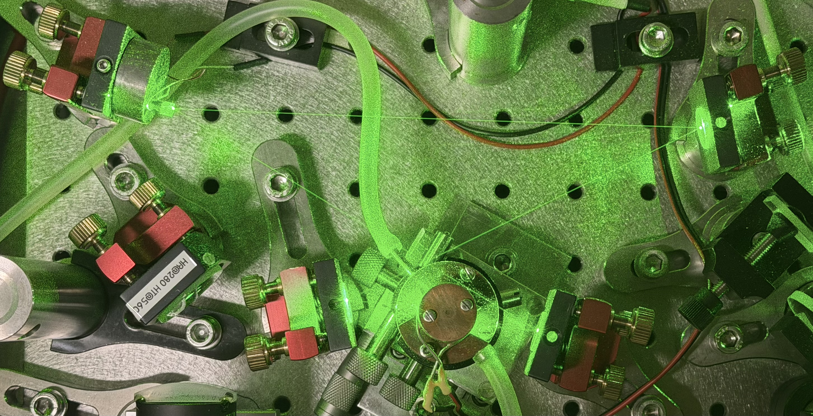
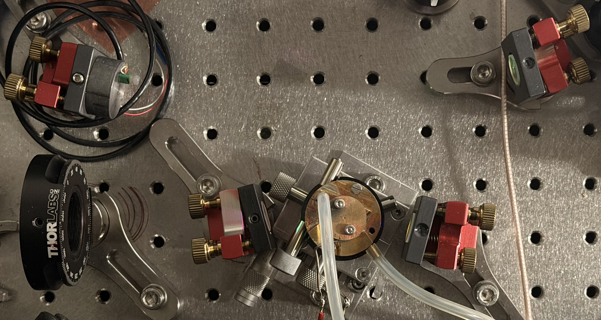
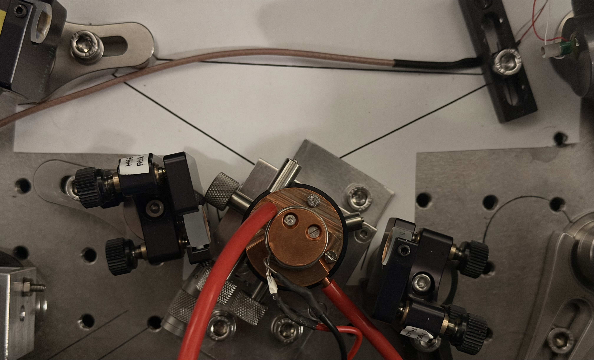

<strong>Endorsement Marker.</strong> Local lab record — AG Schätz stewardship. This page archives top-view photographs of three home-built 559&nbsp;→&nbsp;280&nbsp;nm doublers currently in operation in the lab and extracts what is directly observable in those photographs. It is <em>not</em> a build specification, vendor recommendation, or Phase 4 scoring input; coatings, focal lengths, and exact path lengths must be confirmed at the bench before any item is reused in a new build.

Components · home-built doublers

# Home-built BBO doublers — photographic survey (2026-05)

**Status:** DRAFT (2026-05-13). Three photographs archived under
[`docs/assets/components/home-built-doublers/`](https://github.com/uwarring82/mg-plus-uv-chain/tree/main/docs/assets/components/home-built-doublers);
geometric extraction is observational only.

**Scope.** Three home-built 559&nbsp;→&nbsp;280&nbsp;nm SHG ring cavities — the
**Raman**, **BD** (blue-Doppler / cooling), and **RD** (red-Doppler / repump)
doublers of the Bermuda ²⁵Mg⁺ apparatus — are currently on duty in the lab.
Each is the downstream BBO stage of an independent
559&nbsp;nm&nbsp;→&nbsp;280&nbsp;nm doubling chain feeding a distinct 280-nm
laser line at the ion. They share a common topology that matches the
[Friedenauer 2006 BBO ring](friedenauer-baseline.html#d-bbo-ring-cavity-559-nm--near-280-nm)
(§3, Table 1). This page records what the top-view photographs show; it does
not measure coatings, focal lengths, or path lengths.

**Charter compliance.** This page is a Phase 1-equivalent literature / lab
artefact (observational record of fielded hardware). It is not
architecture-family-specific simulation, does not commit any new code to
`/src/`, and does not change a §1.5 Level 0 or Level 1 parameter. G1, G2 remain
open; G3 closed 2026-05-01 — the reference triple
`{Δ_ref = 40 GHz, Ω_R/2π = 400 kHz, Γ_sc = 2.0 × 10⁴ s⁻¹}` is unaffected.

**Provenance tags** (consistent with
[`inventory.md`](inventory.html#provenance-tags-used-in-the-tables-below)):

- `O` — directly visible / readable in the photograph, high confidence.
- `O*` — partially obscured, oblique angle, or low-resolution; flagged.
- `OPEN` — not determinable from the photograph alone.

Photographs were taken from directly above each fielded doubler in May 2026
and committed verbatim (no crop, no re-touch). Filenames are kebab-cased copies
of the originals named `bermuda <line> BBO doubler_2026_05.jpeg`.

---

## A. Shared topology (all three doublers)

All three doublers implement the **four-mirror bowtie ring** SHG cavity of
Friedenauer 2006 §3:

- Two **plane** mirrors on the long-arm side — M1' (input coupler, IC) and M2'
  (high reflector, HR, piezo-mounted for Hänsch–Couillaud lock).
- Two **concave focusing** mirrors at the short-arm waist — M3' (HR) and M4'
  (output coupler, HR @ 559&nbsp;nm + HT @ 280&nbsp;nm).
- A **temperature-controlled BBO oven** at the cavity waist between M3' and
  M4', plumbed for water (or chiller-fluid) temperature control to the
  Friedenauer ~50 °C set-point that prevents condensation on hygroscopic BBO
  surfaces ([Friedenauer 2006 components, §D.4](friedenauer-baseline.html#d4-bbo-crystal-oven)).
- A **dichroic** at the M4' (output) side that lets the 280-nm second harmonic
  exit while recirculating the 559-nm fundamental.

The full folding angle is consistent with the
**27.4°** Friedenauer geometry (13.7° AOI per curved mirror) — i.e., a tight
bowtie compensating Brewster-cut-BBO astigmatism. **Photogrammetric
extraction from the archived photos** (mirror-substrate pixel coordinates on
each kinematic mount → angle between long-arm and short-arm vectors at the
curved-mirror vertex) gives **mean folds of ≈ 26° (BD), ≈ 29° (Raman), and
≈ 25° (RD)** with a ±5° pixel-identification budget — all three within ±5° of
27.4°. This is an `O*` *Sail* observational estimate, not a bench measurement;
the per-doubler V-openings are detailed in §B and the cross-walk row in §C.
A bench protractor / theodolite reading to ±1° is the natural next step and
remains `OPEN`.

**What this topology match means.** The three doublers are direct geometric
relatives of the
[Friedenauer 2006 BBO components](friedenauer-baseline.html#d-bbo-ring-cavity-559-nm--near-280-nm)
inventory and the
[on-shelf BBO sub-assemblies in `inventory.md` §C](inventory.html#c-pre-built--packaged-sub-assemblies).
Specifically, the curved-seat geometry maps to inventory items
[**I-B9**](inventory.html#b-items-keyed-to-the-bbo-stage-559--560-nm--280-nm)
(IBS HR @ 560 nm, R&nbsp;=&nbsp;50&nbsp;mm) and
[**I-B15**](inventory.html#b1-bbo-output-couplers-hr--559-nm--ht--280-nm--these-are-the-most-differentiated-items)
(HR 560 / HT 280, AOI 15°, R&nbsp;=&nbsp;50&nbsp;mm); the plane-seat IC maps to
[**I-B7**](inventory.html#b-items-keyed-to-the-bbo-stage-559--560-nm--280-nm)
(R&nbsp;=&nbsp;98.5%, AOI 15°). These mappings are *plausible*, not asserted —
neither the substrate batch nor the coating run on any fielded mirror has been
read off the photograph.

---

## B. Per-doubler extraction

### B.1 Bermuda **BD** (blue-Doppler / cooling) BBO doubler

*Top view, 2904 × 1489 px original. Archived at [`docs/assets/components/home-built-doublers/bermuda-bd-bbo-doubler-2026-05.jpeg`](https://github.com/uwarring82/mg-plus-uv-chain/blob/main/docs/assets/components/home-built-doublers/bermuda-bd-bbo-doubler-2026-05.jpeg).*

**State at capture.** Active — image flooded with scattered 559-nm pump light
(green channel saturated); a faint scattered-particle line traces the long-arm
beam path. This is the operational top view, not a service view.

**Function.** Generates 280-nm Doppler-cooling light on the
3s&nbsp;S₁/₂&nbsp;↔&nbsp;3p&nbsp;P₃/₂ cycling transition (cooling + state
detection / fluorescence collection).

| Position in frame | Element | Observation | Tag |
|---|---|---|---|
| HBD-BD-M1 | Plane mirror, kinematic mount, red-anodised cube, brass-knob adjusters | Long-arm input coupler (IC) candidate seat | O |
| HBD-BD-M2 | Plane mirror, kinematic mount (matching M1 style) | Long-arm HR seat; piezo cable not visible in this view (occluded by green flooding) | O* |
| HBD-BD-M3 | Concave focusing mirror, kinematic mount | Short-arm focusing HR seat at the crystal waist | O |
| HBD-BD-M4 | Concave focusing mirror, kinematic mount, with a small dichroic-flag label nearby reading `HR@280 HT@56_` (last digit obscured by green glare) | Short-arm focusing OC seat; label substring `HR@280 HT@56_` does **not** match a Friedenauer M4' coating (M4' = HR @ 559 + HT @ 280). Possible readings: (i) label belongs to an adjacent **UV-pickoff** dichroic, not to the cavity OC itself; (ii) label is a service-tag pointing to a different element. Reading flagged for bench verification | O* |
| HBD-BD-OVEN | Central round copper / brass cylindrical housing with two cooling tubes (silicone, green-tinted) | BBO crystal oven, temperature-controlled, water-cooled | O |
| HBD-BD-AUX | Small polished copper disc with two screws, lower-centre of frame | Secondary fixed element (likely a UV-output pickoff or beam-dump mount); function not determinable from photo | O* |
| Breadboard | Grey-painted aluminium, M6-tapped, ~25 mm hole pitch | Standard optical breadboard; ferromagnetic / non-ferromagnetic state not determinable | O |

**Geometric observations.**

- Four-mirror bowtie topology, two curved seats inboard, two plane seats outboard — consistent with the Friedenauer §3 BBO ring (M1'–M2' plane, M3'–M4' concave).
- Approximate cavity footprint (from breadboard hole pitch as a scale ruler):
  short arm M3'–M4' span on the order of ~60–70&nbsp;mm — **consistent with**
  Friedenauer's stated focusing-mirror geometric separation **d' = 59.4&nbsp;mm**
  ([friedenauer-baseline.md §D.1](friedenauer-baseline.html#d1-cavity-mirrors)).
  Full cavity is in-frame; long arms read ≈ 3.5× the short-arm separation,
  giving a round-trip path of order ~0.5&nbsp;m — **consistent with**
  Friedenauer's L_cav = 0.470&nbsp;m within the breadboard-pitch ruler's
  resolution.
- **Full folding angle at the curved mirrors (this work):** ≈ 26° from
  photogrammetric extraction (M3 V-opening 26.6°; M4 V-opening 25.6°; X-cross
  apex angle between the two long arms 52.2°). Uncertainty ≈ ±5° from
  ±20–50&nbsp;px identification of mirror-substrate centres on each kinematic
  mount in the green-flooded image. **Consistent with Friedenauer's 27.4° full
  fold within stated uncertainty.**

**Open extraction items for HBD-BD.**

- Coating identity on M1, M2, M3, M4 (vendor batch / R-value at 559 nm / R at 280 nm where relevant) — *requires labelled close-up photograph of each substrate*.
- Identity of the `HR@280 HT@56_` label (is it a cavity element or an external pickoff?) — *requires high-resolution photograph of the label*.
- Piezo make / model and HC servo-electronics chain — *not visible from top view*.
- Crystal-oven manufacturer / set-point / stability — *not visible from top view*.
- Long-arm cavity length (and therefore FSR) — *out of frame*.

### B.2 Bermuda **Raman** BBO doubler

*Top view, 3026 × 1615 px original. Archived at [`docs/assets/components/home-built-doublers/bermuda-raman-bbo-doubler-2026-05.jpeg`](https://github.com/uwarring82/mg-plus-uv-chain/blob/main/docs/assets/components/home-built-doublers/bermuda-raman-bbo-doubler-2026-05.jpeg).*

**State at capture.** Service view — laser off, no scattered visible light;
breadboard and mounts illuminated by overhead lab lighting. Best of the three
photographs for reading mount geometry.

**Function.** Generates the 280-nm Raman-pair light for stimulated Raman
transitions between ²⁵Mg⁺ 3s S₁/₂ hyperfine ground states (qubit-gate / coherent-control line).

| Position in frame | Element | Observation | Tag |
|---|---|---|---|
| HBD-R-M2 | **Piezo-mounted plane mirror**, top-left — a coil-wound piezo body is directly visible behind the optic | Friedenauer M2' (Hänsch–Couillaud servo seat) — first directly photographed HC mirror in the three-doubler set | O |
| HBD-R-M1 | Plane mirror, kinematic mount, red-anodised, mid-right | Long-arm IC seat | O |
| HBD-R-M3 | Concave focusing mirror, kinematic mount, short-arm-inboard right of oven | Curved HR seat | O |
| HBD-R-M4 | Concave focusing mirror, kinematic mount, short-arm-inboard left of oven | Curved OC seat (HR @ 559 + HT @ 280 dichroic) | O |
| HBD-R-OVEN | Polished brass cylindrical housing centred between M3 and M4, with two cooling-tube fittings and two upright alignment rails on the top face | BBO crystal oven, water-cooled, with crystal-translation rails | O |
| HBD-R-INPUT-WP | Thorlabs-branded black rotation mount on the lower-left, graduated scale visible (degrees, 0–360) | **Half-wave plate (λ/2) rotation mount on the cavity input** — sets the linear polarisation incident on the Brewster-cut BBO | O |
| HBD-R-INPUT-FIB | Salmon / peach-coloured patch-cable bundle entering from upper-right | Input fibre / input-beam delivery; coupling collimator not in this frame | O* |
| Breadboard | Grey-painted aluminium, M6-tapped, ~25 mm hole pitch | Same breadboard style as HBD-BD | O |

**Geometric observations.**

- Same four-mirror bowtie topology as HBD-BD; **same mount style** (red-anodised
  kinematic cubes) for the IC / focusing seats.
- The piezo-mounted HR (HBD-R-M2) is **directly visible** here whereas it was
  occluded in HBD-BD. This is the first usable photograph of the HC servo seat
  in the three-doubler set and identifies the long-arm-HR-side mirror as the
  servo-loaded element.
- The Thorlabs rotation mount on the input side is an **input polarisation
  control element** (λ/2 plate) that sits between the input-fibre collimator
  and the IC. Friedenauer 2006 §3 does not enumerate this element by name; it
  is a *de facto* requirement for any Brewster-cut-crystal cavity.
- Crystal-oven design includes **two upright alignment rails** on the top
  face — these are crystal-translation guides not present (or not visible) in
  HBD-BD; consistent with a slightly later mechanical revision of the oven
  body.
- Approximate short-arm M3-M4 span: comparable to HBD-BD; estimating from the
  breadboard hole pitch gives ~60–70 mm — **consistent with d' = 59.4 mm**.
  Long arms read ≈ 2.7× the short-arm separation in this image — slightly
  tighter than HBD-BD's 3.5×; round-trip path on the order of 0.4–0.5 m,
  **consistent with** Friedenauer's L_cav = 0.470 m.
- **Full folding angle at the curved mirrors (this work):** ≈ 29° from
  photogrammetric extraction (M3 V-opening 30.5°; M4 V-opening 28.0°; X-cross
  apex angle between the two long arms 58.5°). Uncertainty ≈ ±5° (same
  pixel-identification budget as HBD-BD; here unaided by green scatter so
  mount centres are cleaner). **Consistent with Friedenauer's 27.4° full fold
  within stated uncertainty.** The ≈ 3° difference between HBD-R and HBD-BD
  mean folds is comparable to the photogrammetric ±5° band and **cannot be
  resolved as a real build-to-build difference from these photographs alone**.

**Open extraction items for HBD-R.**

- Piezo make / model, glue type, and lead-disk presence (`Friedenauer 2006`
  used a Thorlabs **AE020304D04** stacked piezo on a lead disk — see
  [components §B.2](friedenauer-baseline.html#b2-piezo-and-mount)).
- Specific λ/2 plate part number (Thorlabs rotation mount is identifiable but
  the optic itself is not).
- Whether the polished oven body is the same physical part across the three
  doublers, or three independently-machined instances.
- Coating identities (same caveat as HBD-BD).
- Whether the salmon-coloured patch cable on the input is a SMF-PM fibre, a
  power lead, or a temperature-sensor lead — `O*`.

### B.3 Bermuda **RD** (red-Doppler / repump) BBO doubler

*Top view, 4032 × 2447 px original. Archived at [`docs/assets/components/home-built-doublers/bermuda-rd-bbo-doubler-2026-05.jpeg`](https://github.com/uwarring82/mg-plus-uv-chain/blob/main/docs/assets/components/home-built-doublers/bermuda-rd-bbo-doubler-2026-05.jpeg).*

**State at capture.** Service view — laser off, well lit. Highest-resolution
photograph of the three; usable for label transcription on close inspection.

**Function.** Generates 280-nm repump light on the
3s&nbsp;S₁/₂&nbsp;↔&nbsp;3p&nbsp;P₁/₂ transition, repumping population out of
the dark hyperfine ground state during Doppler cooling and detection.

| Position in frame | Element | Observation | Tag |
|---|---|---|---|
| HBD-RD-M2 | Plane mirror, kinematic mount, **black-anodised** body with white labels — distinct vendor from HBD-BD / HBD-R | Long-arm HR / piezo seat; **red insulated lead** entering the top of this mount **is the piezo-drive line** | O |
| HBD-RD-M1 | Plane mirror, kinematic mount (matching M2 style); white side-label fragment readable as `HH56` or `HR56` (substrate ID) plus `Rück...` (German for *back* — i.e., back-of-substrate annotation) | Long-arm IC seat | O* |
| HBD-RD-M3 | Concave focusing mirror, kinematic mount, short-arm-inboard left of oven | Curved HR seat | O |
| HBD-RD-M4 | Concave focusing mirror, kinematic mount, short-arm-inboard right of oven; faint label fragment `R/A` partially visible on side flag | Curved OC seat (HR @ 559 + HT @ 280 dichroic) | O* |
| HBD-RD-OVEN | Polished copper cylindrical housing, central in frame, with two horizontal alignment rails and two top-face screws | BBO crystal oven, copper body | O |
| HBD-RD-COOL | Red-orange silicone / rubber tubing entering the oven from the top of frame | Water-cooling line | O |
| HBD-RD-PIEZO-LEAD | Red insulated cable, top-left to top-right of frame, terminating at HBD-RD-M2 | Piezo drive line for HC servo | O |
| Breadboard | Same grey-painted aluminium / M6-tapped style as HBD-BD and HBD-R | O |

**Geometric observations.**

- Same four-mirror bowtie topology as HBD-BD and HBD-R.
- **Distinct mount-vendor style** (black-anodised bodies with white side-labels,
  vs. the red-anodised cubes used in HBD-BD and HBD-R). This is the most
  visibly heterogeneous element in the three-doubler set; the cavity layout
  itself is unchanged.
- The **piezo lead is directly photographed** (red insulated cable) — confirms
  that the long-arm HR mirror (HBD-RD-M2) is the HC servo seat, the same
  role assignment as in HBD-R.
- White side-labels on the M1 / M2 substrates suggest **substrate-level
  inventory labels** (handwritten or printed); they would identify coating
  batch if photographed at higher resolution and angled to capture the full
  text.
- Approximate short-arm M3-M4 span: same as the other two doublers within the
  resolution of the breadboard hole-pitch ruler — **consistent with d' = 59.4 mm**.
- **Full folding angle at the curved mirrors (this work):** ≈ 25° from
  photogrammetric extraction (M3 V-opening 27.4°; M4 V-opening 23.1°; X-cross
  apex angle between the two long arms 50.5°). Uncertainty ≈ ±5° (same
  pixel-identification budget as the other two doublers). **Consistent with
  Friedenauer's 27.4° full fold within stated uncertainty.** The 4° asymmetry
  between M3 and M4 V-openings is also within the photogrammetric ±5° band —
  in particular, the M4 substrate centre in the black-anodised mount is harder
  to read than the others because the mount face is partly in shadow.

**Open extraction items for HBD-RD.**

- Full transcription of M1 / M2 side-labels (`HH56` / `HR56` / `Rück...`,
  `R/A`...) — *requires close-up of the substrate side flags*.
- Mirror-mount vendor (black-anodised body is **not** the same as HBD-BD /
  HBD-R; candidates include older Newport / Lees / Owis units. Identifying
  vendor matters for replacement / piezo-mount compatibility).
- Piezo make / model behind HBD-RD-M2 — *not visible under the mount cap*.
- Whether the lighter oven body (HBD-RD-OVEN appears more polished-copper than
  the HBD-R oven) is the same revision or an earlier / later one.

---

## C. Cross-walk: lab-fielded ↔ Friedenauer 2006 ↔ on-shelf inventory

| Friedenauer 2006 role | Lab-fielded seat (this page) | On-shelf inventory candidate (`inventory.md`) | Confidence |
|---|---|---|---|
| BBO ring topology — four-mirror bowtie, 27.4° fold, L = 0.470 m, d' = 59.4 mm | **Photogrammetric fold angle (this work, ±5°):** HBD-BD ≈ 26°, HBD-R ≈ 29°, HBD-RD ≈ 25°. All three within ±2–3° of Friedenauer's 27.4°. Path length **consistent** with L ≈ 0.5 m but not absolutely measured (no in-frame ruler) | n/a | Topology + fold angle: high (mean of M3 / M4 V-openings, see per-doubler §B); absolute lengths: *consistent, not measured* |
| M1' plane IC, R ≈ 0.984 @ 559 nm | HBD-BD-M1, HBD-R-M1, HBD-RD-M1 | [I-B7](inventory.html#b-items-keyed-to-the-bbo-stage-559--560-nm--280-nm) (R = 98.5 %, AOI 15°) — closest match | Plausible — coating run not read off mounted optic |
| M2' plane HR (HC piezo seat), R > 0.9993 @ 559 nm | HBD-R-M2 (piezo directly visible); HBD-RD-M2 (piezo lead visible); HBD-BD-M2 (occluded by green flooding) | [I-B6](inventory.html#b-items-keyed-to-the-bbo-stage-559--560-nm--280-nm) IBS HR @ 560 nm — *if R-value verified* | Plausible |
| M3' concave HR, R = 50 mm, R > 0.9993 @ 559 nm | HBD-BD-M3, HBD-R-M3, HBD-RD-M3 | [I-B9](inventory.html#b-items-keyed-to-the-bbo-stage-559--560-nm--280-nm) (IBS HR, R = 50 mm, AOI 15°) | Plausible — direct geometric match |
| M4' concave OC, R = 50 mm, HR @ 559 + HT @ 280 | HBD-BD-M4, HBD-R-M4, HBD-RD-M4 | [I-B15](inventory.html#b1-bbo-output-couplers-hr--559-nm--ht--280-nm--these-are-the-most-differentiated-items) (HR 560 / HT 280, AOI 15°, R = ±50 mm) | Plausible — direct geometric match |
| BBO crystal — Brewster-cut, 4 × 4 × 10 mm³ | HBD-BD-OVEN, HBD-R-OVEN, HBD-RD-OVEN (all temperature-controlled, water-cooled) | [I-B20 / I-B21 / I-B22](inventory.html#b2-bbo-crystals--brewster-cut-type-i-4--4--10-mm-θ--444) (Raicol 2025 / A-Star 2017 / Castech 2009 stocks) | Cannot identify lot from crystal-oven exterior view alone |
| BBO oven, ~50 °C, mechanism `OPEN` per Friedenauer §D.4 | All three doublers use a custom polished-metal oven body with external coolant plumbing; **mechanical revision differs** between HBD-BD / HBD-R / HBD-RD (rails, body finish) | n/a | Oven manufacturer / set-point / stability is OPEN per Friedenauer; same gap stands here |
| HC servo, polarisation analyser path, piezo, photodetectors | Piezo seat identified in HBD-R and HBD-RD; full analyser-path elements not in frame | n/a | Optomechanical seat: confirmed. Electronics: out of scope of top-view photo |

---

## D. What this page does NOT establish

- **Coating measurements.** No reflectivity, transmission, or scatter value
  has been read off any fielded optic. All coating identities are *inferred
  from topology*, not measured.
- **Absolute path lengths.** Inferred to be *consistent with* Friedenauer's
  L_cav = 0.470 m from breadboard-hole-pitch scaling, but not measured to
  better than ~10 % from a single top view without an in-frame ruler.
- **Fold angles to bench-grade precision.** The photogrammetric reading in
  §B and §C is `O*` *Sail* — pin-points each doubler to ±5° from the long-arm
  and short-arm vectors at the curved-mirror vertices. A protractor /
  theodolite reading to ±1° (or, equivalently, a beam-card photograph with
  the laser visibly traced) is still `OPEN`. The 4° spread between the three
  per-doubler mean folds (26° / 29° / 25°) sits inside the ±5° band and is
  therefore **not resolved** as a real build-to-build difference from these
  photographs alone.
- **Crystal lot / vendor / age.** The oven exterior does not reveal which of
  the inventory lots ([I-B20](inventory.html#b2-bbo-crystals--brewster-cut-type-i-4--4--10-mm-θ--444)
  Raicol 2025, [I-B21](inventory.html#b2-bbo-crystals--brewster-cut-type-i-4--4--10-mm-θ--444)
  A-Star 2017, [I-B22](inventory.html#b2-bbo-crystals--brewster-cut-type-i-4--4--10-mm-θ--444)
  Castech 2009) is in each cavity — or whether any fielded crystal is from a
  lot not in the current on-shelf inventory.
- **HC servo electronics and bandwidth.** The Friedenauer-stated ≈ 18 kHz
  loaded-piezo resonance ([components §B.2](friedenauer-baseline.html#b2-piezo-and-mount))
  is the seed-laser linewidth's binding term per the
  [VECSEL seed-laser page](seed-lasers.html#single-frequency-narrow-linewidth-coastline);
  none of the three doublers' actual servo bandwidth is visible in a
  top-view photo. Treat as `OPEN` until characterised.
- **UV output power, beam shape, and stability** at each doubler's output —
  these are operational measurements, not geometric features.
- **Polarisation-control chain upstream of each IC.** Only the HBD-R
  doubler shows a clearly identifiable input λ/2 rotation mount; the same
  element may exist for HBD-BD and HBD-RD but is out of the photographed
  frame.
- **Whether any of the three doublers is the candidate physical seat for the
  next-generation 500-mW build.** That decision is governed by the
  [next-gen workplan](../architectures/next-gen.html); this page is an
  archive of *current* hardware, not a build commitment.

---

## E. Suggested follow-on photographs

Listed in priority order for closing the `O*` / `OPEN` items above:

1. **Close-up of each substrate side-label** on HBD-RD (M1, M2, M3, M4) — the
   white labels are the highest-information-density artefact visible in the
   three photographs and the HBD-RD photo has the best resolution for it.
2. **Close-up of the `HR@280 HT@56_` flag** in HBD-BD to disambiguate whether
   it labels a cavity element or an external pickoff.
3. **Side / oblique view of each crystal oven** to read off the oven
   manufacturer / part number / set-point label (if any).
4. **Long-arm shot of HBD-BD** that captures the M1 and M2 plane mirrors fully
   in-frame (the current top-view crops the upper edge of this cavity).
5. **Top view of each doubler's input optomechanics** (fibre collimator,
   isolator, λ/2 plate) — currently only partly visible for HBD-R; not in
   frame for HBD-BD or HBD-RD.

---

## F. See also

- [Friedenauer 2006 components](friedenauer-baseline.html) — the published
  BBO-ring specification that the three fielded doublers are direct
  topological relatives of.
- [Optical-components inventory](inventory.html) — on-shelf stock for the
  BBO stage, including the candidate mirrors / output couplers / sub-assemblies
  cross-walked in §C above.
- [Seed lasers (VECSEL)](seed-lasers.html) — the upstream source class
  feeding any 559&nbsp;nm&nbsp;→&nbsp;280&nbsp;nm doubler; the HC servo
  bandwidth that bounds the seed-laser linewidth criterion is the same
  ~18&nbsp;kHz number that bounds each fielded doubler.
- [Architectures → Next-generation 500 mW](../architectures/next-gen.html) —
  the doubling-chain workplan that takes the fielded doublers as one of
  several candidate physical seats for the next-gen build.
