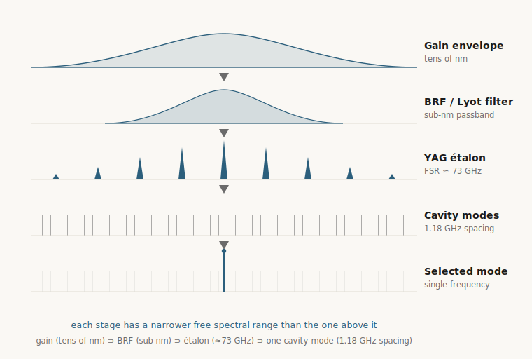

<p class="endorsement"><strong>Endorsement Marker.</strong> Local pedagogical material — AG Schätz stewardship. This tutorial explains how the in-house VECSEL seed lasers work and which parameters limit their linewidth; it is not a build commitment, a vendor recommendation, or a Phase 4 scoring input. The source-class direction it teaches is recorded separately in the <a href="../components/seed-lasers.html">seed-lasers components page</a>.</p>

<p class="eyebrow">Tutorial · seed-laser systems</p>

# VECSEL systems — 1118 nm and 1141 nm

> **After this tutorial you should be able to:**
>
> - explain why a VECSEL gain mirror is *simultaneously* the amplifier and one cavity mirror;
> - read the nested Lyot → étalon → cavity-mode hierarchy as a single-frequency **mode-selection budget**;
> - say why the **short-term linewidth budget** is bound by the doubling-cavity lock bandwidth (~18 kHz), while the ²⁵Mg⁺ atomic linewidth (41.8 MHz) and the iodine lock matter at other levels;
> - name the dominant technical noise sources that have limited the in-house seed linewidth, and how each was closed.

**Status:** TUTORIAL (pedagogical surface, 2026-06-26). Synthesises the in-house thesis lineage (Kiefer 2020 → Guth 2021 → Spanke 2023 → Spanke 2025) and the NIST + Tampere design literature (Burd 2016, Burd 2023) into a single explanation of how the seed lasers work and what limits their linewidth.

**Charter compliance.** This page is a pedagogical tutorial over published in-house and external literature. It does **not** introduce architecture-family-specific simulation in `/src/` (anti-seeding clause, [principles §5.1](../principles.html)); it does **not** advance or close **G1**, **G2**, or **G3**; and it leaves the reference triple `{Δ_ref = 40 GHz, Ω_R/2π = 400 kHz, Γ_sc = 2.0 × 10⁴ s⁻¹}` (locked at G3 closure 2026-05-01) unaffected. Every quantitative claim is provenance-linked to an extraction under [`data/literature/`](https://github.com/uwarring82/mg-plus-uv-chain/blob/main/data/literature/).

> **Key terms** (glossed again at first use below):
>
> - **VECSEL** — vertical-external-cavity surface-emitting laser; an optically-pumped semiconductor disk laser.
> - **DBR** — distributed Bragg reflector: the stack of quarter-wave semiconductor layers that forms the high-reflectivity mirror built into the gain chip.
> - **RPG** — resonant periodic gain: quantum wells placed at the antinodes of the cavity standing wave to maximise gain overlap.
> - **ASE** — amplified spontaneous emission: broadband stray light near the lasing wavelength that pedestals the spectrum.
> - **BRF / Lyot filter** — birefringent (Lyot) filter: a wavelength-selective intracavity plate used at Brewster angle.
> - **FSR** — free spectral range: the frequency spacing between an étalon's or a cavity's transmission peaks.
> - **Mode-hop-free range** — the continuous frequency span you can tune over before the laser jumps to a different longitudinal mode.
> - **RIN** — relative intensity noise: fractional power-fluctuation spectral density, usually quoted in dBc/Hz.
> - **Henry α factor** — the linewidth-enhancement factor of a semiconductor gain medium; it couples amplitude fluctuations into frequency (phase) fluctuations.

---

## What this tutorial covers

The project runs **two** VECSEL seed lasers, distinguished by the trapped-ion task they serve. Both are frequency-**quadrupled** (two cascaded second-harmonic stages) from the near-infrared seed to the deep ultraviolet:

| Seed (this tutorial) | × 4 → UV | ²⁵Mg⁺ task | Gain chip | In-house lineage | NIST/Tampere analogue |
|---|---|---|---|---|---|
| **~1118 nm** ("near 1120 nm") | **280 nm** (D lines) | Doppler cooling · detection · repump · stimulated Raman | GaInAs/GaAs | "VECSEL Nr.4" → "neXt VECSEL Nr.6" (Kiefer 2020 → Guth 2021 → Spanke 2023 → Spanke 2025) | IC system, 1117 nm (Burd 2016) |
| **~1141 nm** ("near 1140 nm") | **285 nm** | Resonance-enhanced photoionisation (isotope-selective loading) | GaInAs/GaAs, **red-detuned** gain chip | in-house #2 "Heidi" — in use (PAULA / BERMUDA) | VC system, 1141 nm (Burd 2016) |

The quadrupling map is exact arithmetic on the ²⁵Mg⁺ structure:

- **280 nm cooling/detection.** The 3s ²S₁/₂ → 3p ²P₃/₂ (D2) line sits at ≈ 279.6 nm, so the seed runs at **4 λ_D2 ≈ 1118.5 nm**; the 3p ²P₁/₂ (D1) line at ≈ 280.4 nm needs **4 λ_D1 ≈ 1121.4 nm**. A single gain chip emitting across **1116–1122 nm** (Kiefer 2020, gain-bandwidth tuning) reaches both — this is why "near 1120 nm" is the right way to name it: one laser covers the whole 280 nm manifold.
- **285 nm photoionisation.** Neutral Mg has a 3s² ¹S₀ → 3s3p ¹P₁ resonance at ≈ 285.2 nm; the second VECSEL runs at **4 × 285.2 ≈ 1141 nm** to drive the first (resonant) step of a 1+1 resonance-enhanced multiphoton ionisation, the isotope-selective loading scheme of [[Kjae00]](../references.html#kjae00).

The rest of the tutorial is three sections, in the order the physics builds:

1. **[Gain properties](#1-gain-properties-the-semiconductor-gain-mirror)** — what the semiconductor gain mirror provides and how temperature moves it.
2. **[Intracavity filtering](#2-intracavity-filtering--single-frequency-selection)** — how a broadband gain medium is forced onto one longitudinal mode.
3. **[Parameter sensitivities → linewidth](#3-parameter-sensitivities--linewidth-limitations)** — which knobs convert into frequency noise, and the in-house record of closing them.

> **Prerequisite framing.** *Why* a VECSEL (the class-A argument, the source-class steward direction) is on the [seed-lasers components page](../components/seed-lasers.html); this tutorial assumes it and goes inside the device. *What happens after* the seed — the LBO + BBO doubling chain — is the [SHG numerics tutorial series](index.html).

> **Evidence labels** (used in the tables and §4 to keep evidence classes separate): **[in-house]** measured in the AG Schätz lab · **[external]** peer-reviewed external result · **[analogue]** a comparable but *different* device · **[inferred]** deduced, not directly measured · **[open]** not yet measured or extracted.

---

## 1. Gain properties: the semiconductor gain mirror

<p class="classification classification--coastline">Coastline · the gain medium and its thermal behaviour are fixed, measurable device properties testable against [Kief20] §3.3.1 and [Burd16] §2.</p>

*(Throughout this page, **Coastline** marks a testable, literature-anchored constraint; **Sail** marks adaptive guidance whose exact value depends on the local build. The vocabulary is defined in [principles](../principles.html).)*

A **VECSEL** (vertical-external-cavity surface-emitting laser) gain mirror is a single epitaxial semiconductor chip that is *both* the amplifier and one cavity end mirror. Reading it from the substrate outward:

- A monolithic **distributed Bragg reflector (DBR)** — many GaAs/AlGaAs quarter-wave pairs — forms the high-reflectivity cavity end.
- On top of the DBR, multiple **quantum wells** are placed at the **antinodes** of the intracavity optical standing wave. This *resonant periodic gain* (RPG) arrangement maximises the overlap between the carriers and the field. Burd 2023's 940 nm chip uses 24 QWs; the in-house 1118 nm chip is a Kiefer 2020 Vexlum flip-chip GaInAs/GaAs structure.
- A **CVD-diamond heat spreader** (3.0 × 3.0 × 0.3 mm, [Kief20]) is bonded to the chip to pull heat out laterally, and the stack sits on a Peltier-stabilised, water-cooled copper carrier.

The chip is **optically pumped** by a multimode fibre-coupled diode at ≈ 808 nm. The pump is absorbed in the barriers; carriers relax into the wells and provide gain at a wavelength set by the well composition and width. (In-house: Ostech 40 W, 808 nm, volume-Bragg-grating-stabilised, [Kief20]; NIST: 807 nm, 21 W, [Burd16].)

### Three gain properties that matter downstream

**Broad gain bandwidth → tunability.** The quantum-well gain spectrum is tens of nanometres wide. For the 1118 nm chip the *useful* single-mode emission spans **1116–1122 nm** ([Kief20]), which is exactly what lets one device cover both ²⁵Mg⁺ D lines (4 λ_D2 ≈ 1118.5 nm and 4 λ_D1 ≈ 1121.4 nm). The 1141 nm photoionisation chip is the **same material system with a red-detuned well design** ([Guth21] §4) — a deliberate composition shift, not a different technology.

**Short carrier lifetime → class-A dynamics.** Semiconductor carrier lifetime (~ns) is far shorter than the cavity photon lifetime of the long external resonator. The laser is therefore *photon-lifetime-dominated* (class-A): **no relaxation-oscillation resonance** and a **structurally suppressed ASE pedestal** (ASE = amplified spontaneous emission, the broadband stray light that would otherwise sit under the laser line). This is the gain-*dynamics* property that makes the VECSEL spectrally clean — and it is the reason the seed's intrinsic (quantum-limited) linewidth is tiny, so that the *measured* linewidth is set by technical noise (Section 3), not by the gain itself. (Burd 2023 §1–2; restated on the [components page](../components/seed-lasers.html).)

**Gain-peak temperature sensitivity → the load-bearing thermal constraint.** The quantum-well gain peak **red-shifts with temperature** at roughly **0.12–0.15 nm/K** (gain-chip temperature, [Kief20]). Two consequences:

- *It is a tuning knob.* Coarse wavelength setting is done by the gain-chip TEC set-point.
- *It is the dominant disturbance.* The chip's efficiency depends on the detuning between the gain peak and the chip's own micro-cavity (sub-cavity) resonance; both move with temperature, and any drift in pump-deposited heat moves the operating point. This is why the 1141 nm VC gain mirror is run **cold (8 °C)** in [Burd16], and why thermal management — diamond spreader, dual-stage cooling, low-drift TECs — is treated as a first-class design layer rather than an afterthought. It is also the entry point for most of the linewidth-limiting sensitivities in Section 3.

One more gain property bridges directly to linewidth: the **linewidth-enhancement (Henry α) factor**. In any semiconductor gain medium, carrier-density fluctuations modulate the refractive index as well as the gain, so **amplitude noise is partly converted into phase/frequency noise**, broadening the line by a factor (1 + α²). [Kief20] names the Henry factor as the high-frequency intensity-to-frequency-noise coupler. Keep it in mind: it is the mechanism by which *pump* and *thermal* amplitude disturbances become *frequency* noise.

```
  808 nm pump (multimode diode, VBG-stabilised)
        │
        ▼
  ┌───────────────────────────────────────────────┐
  │  GAIN MIRROR (= amplifier + cavity end mirror) │
  │  AR surface ─ QWs at standing-wave antinodes   │
  │             ─ monolithic GaAs/AlGaAs DBR       │
  │             ─ CVD-diamond heat spreader        │
  │             ─ Peltier + water-cooled Cu carrier│
  │   GaInAs/GaAs:  1118 nm  (red-detuned: 1141 nm)│
  └───────────────────────────────────────────────┘
        gain bandwidth ~ tens of nm  →  needs filtering (Section 2)
```

---

## 2. Intracavity filtering — single-frequency selection

<p class="classification classification--coastline">Coastline · the filter free spectral ranges and the cavity mode spacing are fixed by component geometry; testable against [Kief20] §3.3.1 part numbers and [Span25] re-measurements.</p>

The gain medium is broadband and the external cavity is long, so left alone the laser would run multi-mode. **Single-frequency operation is engineered by a nested set of filters**, each acting on a different frequency scale. The mechanism is not that any one filter is "narrow enough" on its own — it is the **product of their losses**: the lasing mode is the one with the lowest *total* round-trip loss, and it stays single-frequency only if that loss advantage over every competing mode exceeds what the homogeneously-broadened gain can equalise. A broad filter with a small per-mode loss slope can still be decisive once multiplied with the others.

The 1118 nm cavity is a **linear (I-shaped) resonator, L ≈ 127.5 mm** (in-house [2021 VECSEL project summary](https://github.com/uwarring82/mg-plus-uv-chain/blob/main/data/lab%20notes/2021-07-vecsel-project-summary.md); ≈ 128 mm in [Kief20]), so its longitudinal-mode spacing is

> FSR_cavity = c / (2L) ≈ 3×10⁸ / (2 × 0.1275) ≈ **1.18 GHz**.

The filter stack, from coarsest to finest (in-house part numbers and measured values from the [2021 VECSEL project summary](https://github.com/uwarring82/mg-plus-uv-chain/blob/main/data/lab%20notes/2021-07-vecsel-project-summary.md) unless noted):

| Stage | Element (in-house part) | Acts on / spacing | What it suppresses | Tuned by |
|---|---|---|---|---|
| Gain | GaInAs/GaAs quantum wells | gain envelope, tens of nm | nothing on its own — it provides gain, not selection | gain-chip temperature (0.12–0.15 nm/K) |
| **Coarse** | **Birefringent (Lyot) filter / BRF** — Newlight quartz, 12.7 mm × 3.0 mm, at Brewster angle **θ_B = 57.15°** | one broad transmission lobe, sub-nm wide (~100s of GHz) | wavelengths outside the chosen ~nm window — and, via the Brewster surfaces, the wrong polarisation | rotation + temperature |
| **Medium** | **YAG étalon** — 5 mm × 1 mm (LightMachinery OP-3167-1000) | transmission comb, **FSR ≈ 73 GHz near 1120 nm, ≈ 70 GHz near 1140 nm** (in-house; nominal 82.3 GHz at 1064 nm) | étalon orders away from the selected peak, within the BRF lobe | étalon temperature (operated 30–55 °C) |
| **Fine** | **Cavity length** — PZT-actuated output coupler (PI P-080.311 ring piezo) | longitudinal-mode comb, 1.18 GHz spacing | every cavity mode but the one aligned with the combined BRF+étalon peak | PZT voltage — **≈ 100 MHz/V** in-house measured (71 MHz/V used in the §3.2 noise budget; spec 5(1) nm/V) |

Read the table as a chain of *partial* filters: none isolates a single mode by itself; the étalon, for example, still leaves ≈ 60 cavity modes under one of its peaks (next paragraph). Single-frequency operation is the **product** of all three loss profiles.

<figure>
  
  <figcaption style="font-size:0.85em;color:#6b6b6b;margin-top:0.4rem;">The mode-selection hierarchy. Each filter has a narrower free spectral range than the one above; their product leaves exactly one surviving cavity mode.</figcaption>
</figure>

**How the birefringent (Lyot) filter works.** A birefringent plate between the Brewster-angled intracavity surfaces rotates the polarisation by a wavelength-dependent amount; only wavelengths that emerge with the original polarisation pass the Brewster surfaces without loss. Tilting/rotating the plate slides this transmission comb. The BRF is the *coarse* wavelength selector — it picks the sub-nanometre window (e.g. the D2 versus D1 region) and, because it works through the Brewster loss, it also fixes the cavity's linear polarisation. (Newlight BIR0030, mounted at θ_B ≈ 57° on a goniometer, temperature-stabilised; [Kief20].)

**How the étalon works.** The uncoated YAG étalon is a weak Fabry–Pérot (a two-surface interferometer whose transmission peaks repeat every FSR) whose ≈ 73 GHz peaks sit *inside* the BRF passband. Temperature-tuning its optical thickness walks one étalon peak onto the desired cavity mode and suppresses the étalon's neighbours. It is the *medium* selector — between the BRF's ~100s-of-GHz window and the cavity's 1.18 GHz comb.

> **For scale.** 73 GHz ≈ **0.30 nm** near 1120 nm (Δλ = λ²Δν/c) — narrow against the gain envelope (tens of nm), but it still brackets ≈ **62 cavity modes** (73 GHz ÷ 1.18 GHz). The étalon alone does not isolate one mode; it hands a much thinner comb to the cavity-length selection below.

**How the cavity (PZT) works.** Even after BRF + étalon, several 1.18 GHz cavity modes can sit under the combined passband. Final selection is by **cavity length**: the PZT moves the output coupler so that exactly one longitudinal mode coincides with the filter maximum and wins the gain competition.

Putting the ranges together gives the **mode-selection budget**:

> gain (tens of nm) ⊃ BRF (sub-nm) ⊃ étalon (≈ 73 GHz) ⊃ **single cavity mode** (1.18 GHz spacing).

#### Tuning ranges (distinct, nested)

"Tunable" means different spans depending on which knob moves — these should not be conflated:

| Knob moved | Continuous (mode-hop-free) span | Note |
|---|---|---|
| **PZT only** (BRF/étalon fixed) | **~1 GHz** ([Span25] neXt, full piezo travel; ~100 MHz on the older Nr.4 platform) | piezo gain ≈ 71–100 MHz/V; the finest, fastest handle |
| **Étalon temperature** (30–55 °C) | **~10 GHz** before a cavity-mode hop ([Span25]) | note: the ≈ 73 GHz étalon FSR is the peak *spacing*, **not** a continuous tuning span — the continuous span is the ~10 GHz before the lasing mode hops |
| **Coordinated BRF + étalon + PZT** | **several 100 GHz** ([Guth21] §3.1) | the practical single-mode retuning range |
| **Gain-chip temperature + BRF** | full **1116–1122 nm** gain envelope (~ several nm; ~0.15 nm/°C, [Span25]) | coarse coverage of the whole manifold |

**For scale.** Sitting anywhere *within one transition's hyperfine/Zeeman manifold* needs only a few GHz — easily inside the PZT/étalon range. But hopping between the two D lines is a far larger move: the D2–D1 fine-structure splitting is ≈ 2.74 THz at the UV ([Burd16]), i.e. **≈ 0.69 THz (~690 GHz) at the 1120 nm seed** — reached by coordinated thermal + gain-chip retuning, *not* by the PZT. The whole span still sits comfortably inside the gain envelope, and far beyond the ~100 GHz of the legacy Yb-fibre laser it replaced.

### Loss budget of the filter stack

The filtering that buys single-frequency operation is also a **loss budget the cavity must afford**, and this connects Section 2 directly to the linewidth limits of Section 3. Every intracavity surface adds round-trip loss and risks a **spurious étalon** — an unwanted Fabry–Pérot between near-parallel faces — that would corrupt the mode selection or pull the frequency. The standard mitigations recur throughout the literature:

- **Brewster mounting** of the BRF (no normal-incidence reflections; also sets polarisation);
- **uncoated, temperature-controlled** étalon faces (the étalon effect is *wanted* here, so its thickness is stabilised rather than suppressed);
- **AR coatings** on the output-coupler back face (< 0.3 % at 1118 nm, [Kief20]);
- a **2° facet wedge** on the diamond heat spreader in the Burd 2023 1252 nm build, to kill a parasitic étalon across the spreader.

Because each element also subtracts from the round-trip gain margin, the output coupler is chosen slightly **over-reflective** to forgive these losses: a **1.5 % output coupler (R ≈ 98.5 %)** at 1120 nm (in-house 2021 summary; R = 97.5 % in the earlier [Kief20] build), comparable to the ~2 % transmission of the Burd 2023 builds. Loss that is not controlled here re-appears in Section 3 as frequency noise, because anything that modulates an intracavity loss or path length modulates the lasing frequency.

```
   GAIN MIRROR ──┐  linear cavity, L = 127.5 mm ┌── OUTPUT COUPLER
                 │  FSR = c/2L ≈ 1.18 GHz       │  R ≈ 98.5 % (1.5 % OC) @ 1120 nm
   [ BRF / Lyot @ Brewster 57.15° ] coarse: sub-nm │  RoC = 200 mm, on PZT
   [ YAG étalon, 5×1 mm ]  medium: ≈ 73 GHz      │
   [ PZT cavity length  ]  fine: 1 mode, ~100 MHz mode-hop-free
                 └──────► single-frequency 1118 nm out
                          → LBO ring → 559 nm → BBO ring → 280 nm
```

---

## 3. Parameter sensitivities → linewidth limitations

<p class="classification classification--coastline">Coastline · the seed frequency-noise requirement is a Level-1 derived optical constraint; for the short-term budget what binds is the residual frequency-noise spectral density shaped by the doubling-cavity/servo transfer function (~18 kHz lock bandwidth), not the integrated linewidth — with the atomic linewidth and the iodine reference binding at other levels (resolution and long-term locking).</p>

This is the section the rest of the tutorial builds toward. The headline:

> **The VECSEL's intrinsic (Schawlow–Townes) linewidth is negligible; its measured linewidth is dominated, in the in-house systems, by technical perturbations of the cavity optical length.** Reducing the linewidth is therefore mostly an exercise in finding and suppressing length-noise sources — which is exactly the story of the in-house thesis lineage.

### 3.1 Why the seed is technical-noise-limited

The fundamental (quantum) limit, the Schawlow–Townes linewidth, scales as Δν_ST ∝ (Δν_c)² / P_out and is broadened by the Henry factor to Δν_ST·(1 + α²). For a class-A VECSEL the cavity is long (so the cavity linewidth Δν_c is small), the circulating power is high, and the ASE pedestal is suppressed — together these push the intrinsic linewidth to the sub-kHz scale. **Every linewidth the project has actually measured (MHz down to ~100 kHz) is orders of magnitude above this floor**, so the floor is not the constraint. What *is* the constraint is technical frequency noise, and all technical frequency noise enters through one door:

> A cavity of optical length L resonates at ν = q·c/(2L). Hence **δν/ν = − δL/L**: *any* perturbation that changes the optical path length L shifts the frequency. Linewidth is the time-averaged spread of those shifts.

### 3.2 The sensitivity ledger

Each row is a physical parameter that modulates L (or, via the Henry factor, modulates amplitude that becomes frequency noise). The **timescale** column says where each one dominates — fast (acoustic/sub-second), medium (seconds–minutes), or slow (minutes–hours, i.e. drift).

| Sensitivity | Timescale | Mechanism (how it moves the frequency) | Evidence / in-house handling |
|---|---|---|---|
| **Mechanical / acoustic** (mount vibration, PZT-driver noise) | fast | Direct δL of the 127.5 mm cavity; PZT gain ≈ 100 MHz/V (in-house) means driver and acoustic noise couple straight to ν | Invar baseplate + ceramic-pedestal enclosure ([Kief20]); passive thermal-radiation design, A4 footprint, noise-isolation box ([Span25]) |
| **Intracavity-element temperature** (gain chip, étalon, BRF) | medium–slow | Gain peak 0.12–0.15 nm/K; étalon/BRF passband centres drift → frequency *pulling* of the selected mode | TEC stability < 0.004 K/h ([Kief20] Arroyo) → **0.08 mK** TEC set-point stability on long timescales ([Span25] custom controller) |
| **Pump power / pump RIN** | fast–medium | Pump fluctuation → heat-load change on the gain chip → optical-path + gain-peak shift; residual amplitude noise → frequency noise via Henry α | VBG-stabilised pump suppresses fibre-multimode beating ([Kief20]); copper cooling sleeve on the pump-fibre output, −14 °C at 22.4 W ([Span23]) |
| **Cooling-water / chiller cycling** | medium | The chiller's on/off thermal cycle modulates gain-chip temperature → large, periodic frequency swing | **The decisive in-house finding:** the legacy Neslab chiller drove ≈ **200 MHz peak-to-peak** oscillation; replacing it with an Alphacool PC-water loop removed it, a **factor-5** short-term improvement ([Span23]). *This is the single clearest example of how a facility-plumbing detail can dominate the linewidth budget.* |
| **Ambient temperature / humidity / air currents** | slow | Slow drift of baseplate length and of the cavity air path's refractive index | Dry-N₂ purge of the enclosure ([Burd23] design parameter); temperature-isolation box ([Span25]) |
| **Absolute-frequency reference drift** (the *lock*, not the laser) | slow | Holds ν against an external reference: wavemeter drift ~ 10 MHz/day; iodine lock bounded by the 125 kHz photodiode bandwidth | Doppler-free iodine saturation spectroscopy + HighFinesse wavemeter, calibrated daily ([Kief20] · [Guth21]) |

The single most instructive entry is the **chiller cycle**: a mundane piece of facility plumbing produced a 200 MHz frequency oscillation — three orders of magnitude larger than the target linewidth — purely by modulating gain-chip temperature. It is the cleanest illustration of "linewidth limitation = cavity-length (here, gain-temperature) sensitivity."

### 3.2.1 In-house measured noise budget (VECSEL #2, 2021)

The [2021 VECSEL project summary](https://github.com/uwarring82/mg-plus-uv-chain/blob/main/data/lab%20notes/2021-07-vecsel-project-summary.md) quantifies this ledger for one of the in-house units (system #2) at a ≈ 1.5 s timescale. Each element's frequency sensitivity is multiplied by its measured RMS fluctuation to give a short-term linewidth contribution:

| Element | Sensitivity | RMS fluctuation (≈ 1.5 s) | Linewidth contribution | Dominant bandwidth |
|---|---|---|---|---|
| Gain chip (via Peltier) temperature | 621(10) MHz/K | ΔT = 3.2(3) mK | **1.98(3) MHz** | 0–100 Hz |
| Base-plate temperature | 2200(100) MHz/K (calc.) | ΔT = 0.36(3) mK | **0.7(1) MHz** | < 1 Hz |
| PZT voltage | 71(1) MHz/V | ΔV < 0.01 V | < 0.71(1) MHz | 0–10 kHz |
| Cold-plate temperature | 425(2) MHz/K | ΔT = 0.42(3) mK | 0.18(2) MHz | 0–0.5 Hz |
| Pump current (at 26 A) | 44(2) MHz/A | ΔA = 0.29 mA | 0.13(1) MHz | 0–100 kHz |
| BRF temperature | < 28(7) MHz/K | ΔT = 4.0(4) mK | 0.11(3) MHz | < 1 Hz |
| Étalon temperature | < 29(14) MHz/K | ΔT = 3.7(3) mK | 0.11(6) MHz | < 1 Hz |
| **Sum of all effects** | | | **< 2.3(2) MHz** | 0–100 kHz |
| **Measured frequency stability** | | | **2.5(1) MHz** | — |

Two lessons jump out. First, **temperature dominates**: the gain-chip and base-plate terms alone account for almost the entire budget — exactly as the qualitative ledger predicts. The base-plate term is large because even the 127.5 mm Invar cavity expands at 153 nm/K (CLTE 1.2 × 10⁻⁶ /K) → 2200 MHz/K. Second, **the budget closes**: the summed estimate (< 2.3 MHz) matches the independently measured linewidth (2.5 MHz) — strong evidence that the device is technical-noise-limited at this timescale, and that the budget captures the dominant terms for this system (it is a closed accounting of the modelled effects, not a proof that no other term exists). The redesign items the note lists for the next units — new cold plate, chiller stability better than ± 0.1 K, a fixed pump-fibre coupler, an active pump-noise photodiode — each target the top rows of this table, and they are what carry the linewidth down through the [Span23] → [Span25] lineage below.

### 3.3 The in-house record: closing the sensitivities one by one

Each thesis in the lineage attacked the then-dominant sensitivity. Read the table as a sensitivity-reduction narrative, not just a scoreboard (Allan deviation at τ = 100 ms unless noted):

| Build | Linewidth @ τ = 100 ms | Dominant limitation addressed | Source |
|---|---|---|---|
| **Kiefer 2020** (origin, "Nr.4") | not measured directly (cited ~ 50 kHz from [Burd16]); passive drift < 50 MHz / hour | first build: established the platform, vendor parts, thermal architecture | [Kief20] §3.3.1 |
| **Guth 2021** | **1.635(13) MHz** free-run · **1.207(12) MHz** iodine-locked | *first quantitative in-house linewidth measurement* — set the baseline to beat | [Guth21] §3.2 |
| **Spanke 2023** | **~ 300–400 kHz** free-run (**factor-5**) | cooling-water chiller cycling + pump-fibre thermal load | [Span23] |
| **Spanke 2025** ("neXt", "Nr.6") | **101(8) kHz** locked (with isolation box) | residual mechanical + thermal drift; passive thermal radiation; custom 0.08 mK TEC | [Span25] |

*(In the in-house convention, a value such as 101(8) kHz means 101 kHz with a 1σ uncertainty of 8 kHz on the last figures, as reported.)*

Spanke 2025 brings the in-house build into the **Burd 2023 ~100 kHz linewidth class** at the actual 1118 nm operating point — the design principles transferred end-to-end, in Freiburg, on a ²⁵Mg⁺-targeted laser. A caution on reading the number: **101(8) kHz is consistent with the ≤ 100 kHz target but is not proof of a sub-100-kHz linewidth** — the 1σ band straddles 100 kHz, and the value is likely limited by the measurement method (locked Allan deviation), not the laser. Establishing a true sub-100-kHz *intrinsic* linewidth would need a delayed self-heterodyne or beat-note measurement against a second narrow laser.

### 3.4 What the linewidth has to beat — and at which level

> **Which linewidth matters, and where.** Three requirements act at different levels — all real, each tightest in a different place:
>
> - **Atomic linewidth (Γ/2π ≈ 41.8 MHz).** Sets the scale the seed must resolve for Doppler cooling and state detection. Every build above meets it with margin — a necessary check, not the tightest constraint.
> - **Long-term absolute frequency (I₂ saturation spectroscopy).** The iodine reference holds the laser on the ²⁵Mg⁺ transition over hours to days; what matters here is the iodine hyperfine features and slow drift, not fast frequency noise.
> - **Short-term frequency noise near the doubling-cavity lock bandwidth (~18 kHz).** This is the term that binds the *short-term linewidth budget*, because the resonant SHG cavities convert seed frequency noise into amplitude noise on the harmonic.
>
> The point is not that the atomic linewidth is irrelevant — it is the cooling/detection requirement, and the iodine lock is the long-term anchor. It is that clearing the 41.8 MHz atomic linewidth does not, on its own, settle the short-term budget, which lives on the much finer ~18 kHz scale.

**The criterion is a transfer function, not a single inequality.** What the doubling stages actually respond to is not the seed's *integrated* linewidth but its residual **frequency-noise spectral density S_δν(f)**, shaped by the cavity and its servo. Each resonant SHG cavity is a tracking filter: seed frequency excursions slower than the lock bandwidth (≈ 18 kHz, the loaded-piezo resonance of the LBO ring, [[Frie06]](../references.html#frie06)) are followed by the lock and largely cancelled, while excursions faster than that are converted into **amplitude** noise on the harmonic (frequency-to-amplitude conversion) and reach the ion. The figure of merit is therefore S_δν(f) weighted by the cavity/servo transfer function around and above ~18 kHz — *not* a single number like Δν_seed.

A rough inequality, Δν_seed ≲ min(Δν_atomic, Δν_lock-related), is still useful as a **sanity check** — it says the seed should not be grossly broader than the relevant scales — but it is neither necessary nor sufficient on its own: a seed with a ~100 kHz integrated linewidth can be perfectly acceptable if its in-band noise density is low, and a seed that nominally "passes" the inequality can still inject too much in-band noise. It is the spectral density, not the integrated linewidth, that has to be controlled:

<figure>
  
  <figcaption style="font-size:0.85em;color:#6b6b6b;margin-top:0.4rem;">Why ~18 kHz binds. The lock tracks out seed frequency noise <em>below</em> ~18 kHz; the residual noise <em>above</em> the lock bandwidth is what converts to amplitude noise on the UV the ion sees.</figcaption>
</figure>

> **For scale.** The ~100 kHz *integrated* seed linewidth is larger than the ~18 kHz lock bandwidth — and that is fine, not a contradiction. An integrated linewidth is dominated by **low-frequency** drift, which is exactly the part the doubling-cavity lock tracks out. The noise that converts to amplitude on the harmonic is the **high-frequency** part, *above* ~18 kHz, that the lock cannot follow. So a large integrated linewidth (mostly slow drift) and a clean harmonic are perfectly compatible — which is why §3.4 insists on the spectral density, not the single number. (The §3.3 work drove down that low-frequency drift; the high-frequency density above ~18 kHz — e.g. pump RIN — is the still-unmeasured term, §3.5.)

The project's operating budget follows from this:

| Budget point | Value | Status |
|---|---|---|
| Target | ≤ 100 kHz | reached to within measurement — Spanke 2025 101(8) kHz, consistent with target; sub-100 kHz not independently proven |
| Friedenauer-parity floor | ≈ 200 kHz | exceeded since Spanke 2023 |
| Stretch ceiling | 50 kHz (Burd 2016 1141 nm parity) | open |

The "linewidth" entries above are integrated-linewidth proxies; the binding quantity remains the in-band frequency-noise density of §3.4, which has not yet been measured at the SHG lock bandwidth (see the box below).

*(Budget values per the [seed-lasers components page](../components/seed-lasers.html) and the [2026-05-08 steward-direction logbook entry](https://github.com/uwarring82/mg-plus-uv-chain/blob/main/logbook/2026-05-08-vecsel-seed-lasers.md).)*

### 3.5 What the in-house data prove — and what they don't

> **Proven.** The dominant **MHz-scale** linewidth in the in-house systems was **technical and reducible**: the §3.2.1 budget closes against the measured value, names temperature and mechanics as the leading terms, and the lineage drove the free-running/locked figure down by more than an order of magnitude (§3.3).
>
> **Not yet proven.**
> - A true **sub-100-kHz intrinsic** linewidth — 101(8) kHz is consistent with, but not below, 100 kHz, and is likely measurement-floor-limited (needs delayed self-heterodyne or a beat note).
> - The **UV relative-intensity noise at the SHG lock bandwidth** — the actual figure of merit of §3.4 — which has not been measured.
> - The in-house **1140 nm** unit's linewidth, output power, and 285 nm conversion (§4).

---

## 4. The two systems, side by side

<p class="classification classification--sail">Sail · the 1140 nm column draws in-house data from the <a href="https://github.com/uwarring82/mg-plus-uv-chain/blob/main/data/lab%20notes/2021-07-vecsel-project-summary.md">2021 VECSEL project summary</a> (fleet system #2, gain chip VXL1140_1078, étalon FSR), with the NIST/Tampere [Burd16] V-cavity device shown as an external analogue. The in-house unit's full linewidth / power / 285 nm-conversion characterisation is not yet in the extracted record.</p>

We include the 1141 nm system here because **it reuses the entire architecture of the 1118 nm laser** — the same linear-cavity platform, the same BRF + étalon + PZT filter stack, the same thermal design. The only deliberate differences are the gain-chip well composition (a *red-detuned* chip that moves emission from ~1118 to ~1141 nm) and the target UV wavelength (280 vs 285 nm). In the in-house fleet this is **system #2 ("Heidi"), in use for photoionisation by the PAULA / BERMUDA experiments**; the 1118 nm cooling/Raman laser is systems #1 and #3.

| | **1118 nm — cooling / detection / Raman** | **1141 nm — photoionisation** |
|---|---|---|
| Seed wavelength | 4 λ_D2 ≈ 1118.5 nm · 4 λ_D1 ≈ 1121.4 nm | ≈ 1141 nm (4 × 285.2 nm) |
| Gain chip (in-house) | GaInAs/GaAs, VL1120_4477_83x/84x, emission 1116–1122 nm | GaInAs/GaAs, **red-detuned VXL1140_1078** (2020) |
| Étalon FSR (in-house) | ≈ 73 GHz | ≈ 70 GHz |
| UV output | **280 nm** | **285 nm** |
| Doubling route | **[in-house]** LBO ring → 559 nm → BBO ring → 280 nm (Friedenauer topology, Hänsch–Couillaud locks) | **[open]** in-house route not detailed in the 2021 summary · **[analogue]** [Burd16] VC: intracavity LBO → 571 nm → BBO |
| Atomic target | ²⁵Mg⁺ 3s→3p (D2/D1) | **neutral Mg** 3s² ¹S₀ → 3s3p ¹P₁ (285.2 nm) |
| Role | Doppler cooling, state detection, repump, stimulated-Raman gates | resonance-enhanced (1+1) photoionisation for **isotope-selective loading** ([[Kjae00]](../references.html#kjae00)) |
| In-house fleet ID | #1 / #3 | **#2 ("Heidi")** — in use by PAULA / BERMUDA |
| Example operating point | **[in-house]** [Guth21]: f = 268.001790(5) THz for ground-state cooling | **[analogue]** [Burd16]: ~ 1 mW at 285 nm at the trap, 26 µm waist, single ²⁵Mg⁺ in ~ 10 s |

### Cavity/filter parameters across the fleet

<p class="classification classification--sail">Sail · in-house values from the <a href="https://github.com/uwarring82/mg-plus-uv-chain/blob/main/data/lab%20notes/2021-07-vecsel-project-summary.md">2021 VECSEL project summary</a>; the Burd 2016 VC column is the external analogue, not the in-house build.</p>

Both in-house wavelengths share **one linear-cavity platform** — only the gain chip and étalon set-point differ. Burd 2016's V-cavity device is shown for contrast because it doubles *intracavity*, a genuinely different topology:

Each value column is one evidence class (see the [evidence labels](#what-this-tutorial-covers) near the top): the two in-house columns are **[in-house]** measured/stated; the Burd 2016 column is an **[external] [analogue]** device. Per-cell **[inferred]** / **[open]** tags mark values that are deduced or not yet extracted, so the in-house and analogue data are never silently blended.

| Parameter | 1118/1120 nm — in-house #1/#3 **[in-house]** | 1140 nm — in-house #2 "Heidi" **[in-house]** | 1141 nm — Burd 2016 VC **[external] [analogue]** |
|---|---|---|---|
| Cavity geometry | linear (I), L ≈ 127.5 mm | linear (I), same platform **[inferred]** | V-cavity, short arm ≈ 65 mm |
| Cavity-mode spacing | FSR ≈ 1.18 GHz | ≈ 1.18 GHz **[inferred]** | geometry-dependent |
| Étalon FSR | ≈ 73 GHz | ≈ 70 GHz | not extracted **[open]** |
| Intracavity doubling | none (external LBO ring) | none assumed (platform standard) **[inferred]** | **intracavity** LBO 3×3×15 mm → 571 nm |
| Gain chip | VL1120_4477_83x/84x | VXL1140_1078 (red-detuned design) | (Tampere 1141 nm) |
| Gain-mirror temperature | 20 °C set-point | not extracted **[open]** | **8 °C** |
| Linewidth | 101(8) kHz locked ([Span25]) | not yet characterised **[open]** | 50(10) kHz (HC error signal) |

When the in-house 1140 nm unit is fully characterised, its measured linewidth, output power, and 285 nm conversion will replace the **[open]** / **[inferred]** entries above.

---

## 5. Open questions

**Build / measurement open items.**

- **1118 nm gain-mirror respecification.** The closest demonstrated gain mirror is Burd 2016's 1117 nm IC chip; a build-specific 1118 nm mirror is an MBE-growth procurement question, with the Tampere ORC group (Guina) the natural collaboration anchor. *(See the [seed-lasers components page](../components/seed-lasers.html) open questions.)*
- **Seed frequency-noise PSD and downstream UV RIN — both unmeasured.** Two distinct quantities (§3.4): the *input* to the budget is the seed's residual **frequency-noise spectral density above the ~18 kHz lock bandwidth**; the *downstream observable* is the **UV relative-intensity noise** that the doubling cavities produce by converting that frequency noise to amplitude noise. Neither is published for the in-house build ([Kief20] · [Guth21] open items). On the input side, pump RIN feeding frequency noise via the Henry α factor is the un-quantified link (§3); on the output side, the UV RIN at the experiment is what actually limits gate/detection fidelity.
- **1141 nm in-house unit (#2 "Heidi").** The [2021 VECSEL project summary](https://github.com/uwarring82/mg-plus-uv-chain/blob/main/data/lab%20notes/2021-07-vecsel-project-summary.md) pins the gain chip (VXL1140_1078) and étalon (≈ 70 GHz) and confirms operational use for photoionisation (PAULA / BERMUDA). Still missing from the extracted record: its measured linewidth, output power, the route to 285 nm, and whether it doubles intra- or extra-cavity. This tutorial will be updated when a full extraction lands.

**Charter governance note.**

- **G2 independence.** None of the above closes **G2**: UV-induced degradation at the 280 nm / 285 nm BBO output is independent of the seed-laser source class.

---

## See also

- [Components — Seed lasers (VECSEL)](../components/seed-lasers.html) — the source-class steward direction and the *why-a-VECSEL* (class-A) argument this tutorial assumes.
- [SHG enhancement-cavity tutorials](index.html) — what happens to the seed downstream: the LBO + BBO doubling chain numerics.
- [References](../references.html) — the literature index ([Burd16] · [Burd23] · [Kief20] · [Guth21] · [Span23] · [Span25] · [Frie06] · [Kjae00]).
- [`data/literature/`](https://github.com/uwarring82/mg-plus-uv-chain/blob/main/data/literature/) — the canonical `extracted.yaml` artefacts every number on this page is drawn from.
- [Principles](../principles.html) — Coastline / Sail vocabulary; anti-seeding clause; the constraint hierarchy this tutorial sits inside.

### Lab notes (internal, AG Schätz)

The in-house figures on this page are drawn from internal AG Schätz lab notebooks, extracted to Markdown. Image/PDF attachments are kept local-only; the converted text is in-repo:

- [**2021 VECSEL project summary**](https://github.com/uwarring82/mg-plus-uv-chain/blob/main/data/lab%20notes/2021-07-vecsel-project-summary.md) — fleet overview (#1–#5), assembly/optical-element details, and the VECSEL #2 frequency-noise budget used throughout Sections 2–4.
- [**2020-11 VECSEL #2 "Heidi" operational diary**](https://github.com/uwarring82/mg-plus-uv-chain/blob/main/data/lab%20notes/2020-11-vecsel-2-heidi.md) — day-by-day operations log for the 1140 nm unit (lab-internal IPs and controller register dumps redacted).
